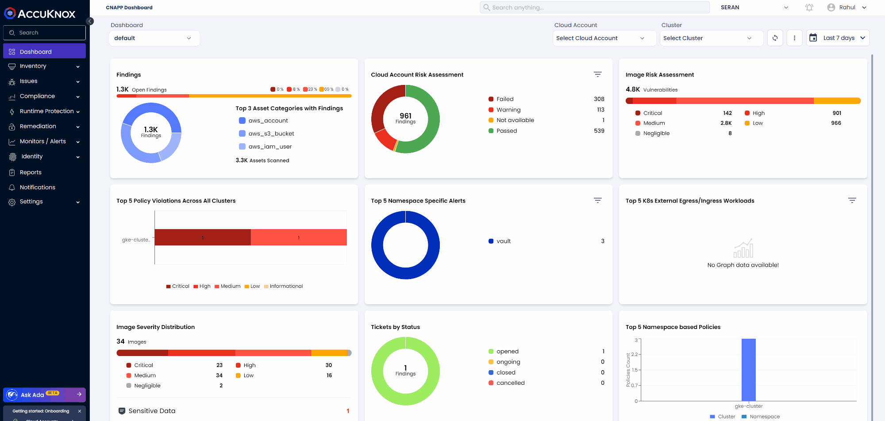

# Sample API scripts

Sample API scripts to help users with achieving certain batch processing tasks by using AccuKnox control plane APIs. For e.g., [export runtime policies](policyDump.sh).

## A User Access Key Token has to be created for using an API

